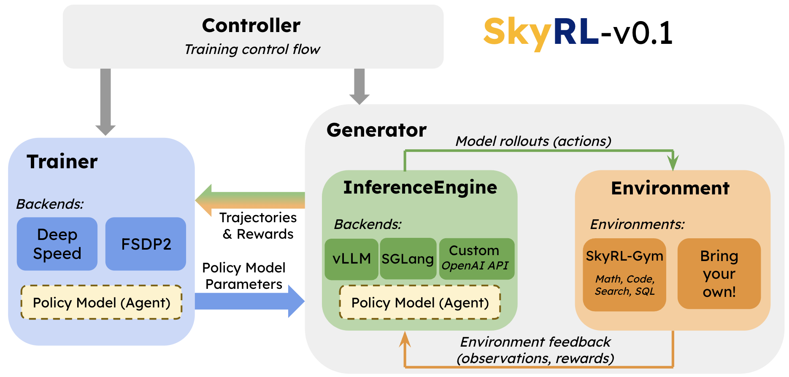

SkyRL System Overview
=====================

SkyRL breaks the RL stack into modular components and provides public APIs for each of them. 

Specifically, as shown in figure below, SkyRL separates training into two major components, **Trainer** and **Generator**, and the Generator is further divided into **InferenceEngine** and **Environment**, with a single **Controller** managing setup and execution of each component. 

The components' responsibilities are as follows:

Trainer
~~~~~~~
Performs the optimization steps based on configured RL algorithm. Updates model parameters based on generated trajectories and their assigned rewards.

- `Trainer Worker interface <https://github.com/NovaSky-AI/SkyRL/blob/main/skyrl-train/skyrl_train/workers/worker.py#L162>`_

  - `FSDP Worker <https://github.com/NovaSky-AI/SkyRL/blob/main/skyrl-train/skyrl_train/workers/fsdp/fsdp_worker.py>`_
  - `DeepSpeed Worker <https://github.com/NovaSky-AI/SkyRL/blob/main/skyrl-train/skyrl_train/workers/deepspeed/deepspeed_worker.py>`_

- `PPORayActorGroup <https://github.com/NovaSky-AI/SkyRL/blob/5a82809e218b2e0c3dd431377fb672e35ecc4a84/skyrl-train/skyrl_train/workers/worker.py#L385>`_: Our abstraction for a group of training workers (as Ray actors) that jointly execute operations for a given model (e.g., policy model, critic model, etc.).

Generator
~~~~~~~~~
Generates complete trajectories and computes their rewards. The Generator encompasses both the InferenceEngine (to get model completions) and Environment (to execute actions) as well as custom agentic or data generation logic build around model inference, such as context management, sampling methods, or tree search.

- `Base Generator interface <https://github.com/NovaSky-AI/SkyRL/blob/main/skyrl-train/skyrl_train/generators/base.py>`_
- `Generator built for SkyRL-Gym <https://github.com/NovaSky-AI/SkyRL/blob/main/skyrl-train/skyrl_train/generators/skyrl_gym_generator.py>`_

InferenceEngine
~~~~~~~~~~~~~~~
Executes inference on the policy model to produce model outputs (i.e., the RL agent's actions). Typically, multiple InferenceEngines are deployed to process prompts in parallel.

- `Base InferenceEngine interface <https://github.com/NovaSky-AI/SkyRL/blob/main/skyrl-train/skyrl_train/inference_engines/base.py>`_
- `InferenceEngine client to manage multiple engines <https://github.com/NovaSky-AI/SkyRL/blob/main/skyrl-train/skyrl_train/inference_engines/inference_engine_client.py>`_
- `vLLM backend <https://github.com/NovaSky-AI/SkyRL/tree/main/skyrl-train/skyrl_train/inference_engines/vllm>`_
- `SGLang backend <https://github.com/NovaSky-AI/SkyRL/blob/main/skyrl-train/skyrl_train/inference_engines/sglang/sglang_server.py>`_

Environment
~~~~~~~~~~~
Presents a task for the policy model to solve, and provides the logic for executing the policy's actions (i.e., model outputs) and computing the resulting observations and rewards.

- `Base Environment interface <https://github.com/NovaSky-AI/SkyRL/blob/main/skyrl-gym/skyrl_gym/core.py>`_
- `SkyRL-Gym <https://github.com/NovaSky-AI/SkyRL/tree/main/skyrl-gym>`_, our ready-built library of tool-use environments

  - `Example environments <https://github.com/NovaSky-AI/SkyRL/tree/main/skyrl-gym/skyrl_gym/envs>`_

Controller
~~~~~~~~~~
Manages physical placement, initialization, and control flow of training execution for each of the above components.

- The training control loop currently sits in `trainer.py <https://github.com/NovaSky-AI/SkyRL/blob/5a82809e218b2e0c3dd431377fb672e35ecc4a84/skyrl-train/skyrl_train/trainer.py#L194>`_
- It is a WIP to move the control loop to a separate component for even greater flexibility.